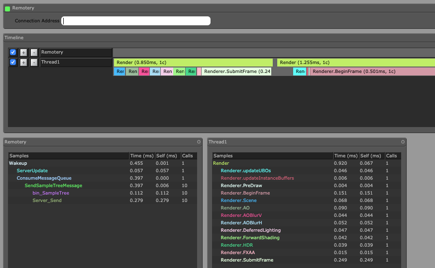

# Profiling

## Using Remotery

scenery includes support for the [Remotery profiler](https://github.com/Celtoys/Remotery). Remotery is a simple profiler that can be used from a browser, either on the same machine, or remotely. Here's the series of steps required to profile a scenery-based application:

Clone the Remotery repository and open `vis/index.html` in a browser. This is the client that connects to the application and visualises profiling results.

In scenery, set up profiling by either handing the \(`SceneryBase`-derived\) application the `scenery.Profiler=true` system property on startup, or adding the a new `Remotery` instance to the `Hub`:



```kotlin
val profiler = Remotery()
hub.add(profiler)
```



```java
final Profiler profiler = new Remotery();
hub.add(profiler);
```



A certain piece of code can then be wrapped in `begin()`and `end()` blocks of Remotery. The profiler object itself can be queried from the Hub, if available in that routine:



```kotlin
val profiler = hub.get<Profiler>()
profiler?.begin("MyProfilingPoint")
// do stuff
profiler?.end()
```



```java
final Profiler profiler = hub.get<Profiler>();
if(profiler == null) {
    System.out.err("Could not get profiler :(");
    System.exit(1);
}

profiler.begin("MyMarker");
// do stuff
profiler.end();
```



When connecting to the Remotery instance on the web browser, you'll see the profiling results, which are updated in realtime:



## Using a 3rd-party Profiler

To profile scenery, a 3rd-party profiler of choice can be used as well. Good candidates are IntelliJ's integrated profiler and Java Flight Recorder. Since Oracle has changed the licensing terms of the JDK recently, we advise to use OpenJDK, and an open-source build of the Java Flight Recorder, which can be used from Java 11 onwards. A good tutorial how to set that up can be found [here](https://dzone.com/articles/using-java-flight-recorder-with-openjdk-11-1).

