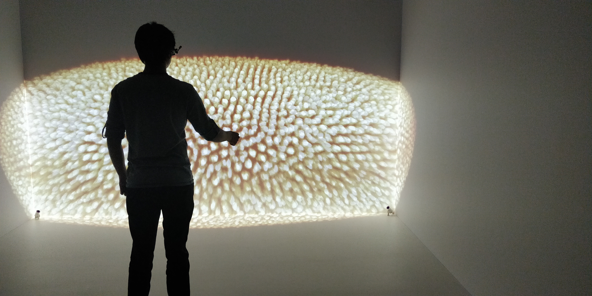
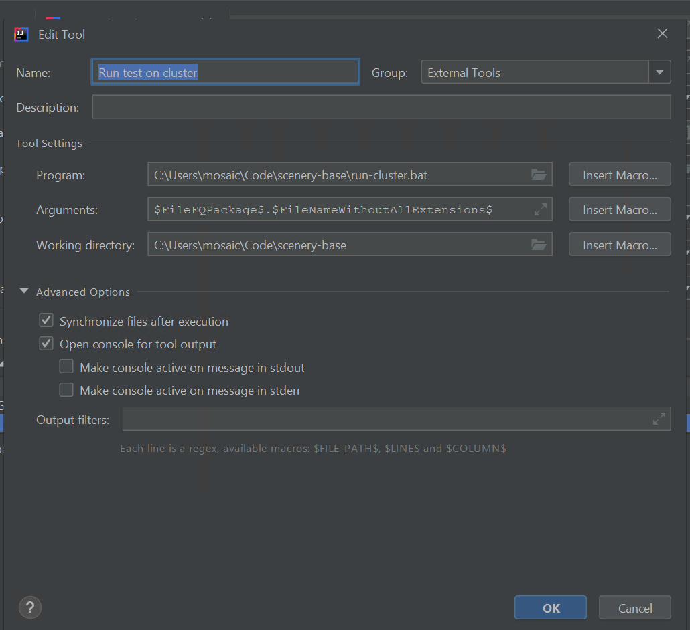

# Rendering on Distributed Machines

_Rendering with distributed setups is still experimental, so this document is very likely to change in the future._



## Requirements

For all machines of the setup:

* current version of Java 11 installed from [adoptopenjdk.net](https://adoptopenjdk.net)
* up-to-date graphics driver \(currently only tested with Nvidia Quadro cards, get the most up-to-date drivers from [nvidia.com/drivers](https://nvidia.com/drivers)\)
* Vulkan SDK installed for debugging, [vulkan.lunarg.com](https://vulkan.lunarg.com)
* psexec for remote execution installed, from [docs.microsoft.com/en-us/sysinternals/downloads/psexec](https://docs.microsoft.com/en-us/sysinternals/downloads/psexec)

For the control node:

* current installation of JetBrains IntelliJ Community Edition for running the examples, [www.jetbrains.com/idea/download/](https://www.jetbrains.com/idea/download/)
* a clone of the scenery git repository, [github.com/scenerygraphics/scenery](https://github.com/scenerygraphics/scenery)
* scenery's cluster scripts, from [github.com/scenerygraphics/cluster-scripts](https://github.com/scenerygraphics/cluster-scripts)

Optionally:

* a remote desktop solution, such as VNC might help with debugging the setup

## Basic Setup

Install the above requirements on the machines, and make sure that processes can be remotely launched with `psexec`, see e.g. [this link](https://www.lifewire.com/psexec-4587631) for details on psexec setup.

In order to run distributed applications, all machines need to access to two network shares, which do not necessarily need to reside on the same machine:

1. a share containing the scenery application directory, including all JARs built, a suggested structure for this is: `# contains the scripts from the cluster-scripts repository path/to/base # contains the scenery git repository and JARs path/to/base/scenery`
2. a share containing the data to be loaded.

The scripts from the `cluster-scripts` repository need to be adjusted for your local setup, in particular the username and password for the rendering node accounts need to be changed, as well as their names, and the name of the network share used. Go through the scripts carefully, they contain comments in places that need to be changed and are very short.

Next, the `pom.xml` file from the scenery repository needs to be imported into IntelliJ on the control node. Open IntelliJ, select the file via `File > Open`, and follow the instructions.

## Screen configuration

In order for scenery to know about your screen configuration, a screen configuration YAML file is required, such file looks like this:

```yaml
name: CAVE example configuration
description: Multi-screen configuration, demoing a 4-sided CAVE environment
screenWidth: 2560
screenHeight: 1600

screens:
  front:
    match:
      type: Property
      value: front
    lowerLeft: -1.92, 0.00, 1.92
    lowerRight: 1.92, 0.00, 1.92
    upperLeft: -1.92, 2.40, 1.92
  left:
      match:
        type: Property
        value: left
      lowerLeft: -1.92, 0.00, -1.92
      lowerRight: -1.92, 0.00, 1.92
      upperLeft: -1.92, 2.40, -1.92
  right:
      match:
        type: Property
        value: right
      lowerLeft: 1.92, 0.00, 1.92
      lowerRight: 1.92, 0.00, -1.92
      upperLeft: 1.92, 2.40, 1.92
  floor:
      match:
        type: Property
        value: floor
      lowerLeft: -1.92, 0.00, -0.48
      lowerRight: 1.92, 0.00, -0.48
      upperLeft: -1.92, 0.00, 1.92

```

We assume that all projectors have the same resolution. When launching on each of the nodes, the appropriate screen is determined using the `match` block. Here, `Property` means the appropriate screen is determined using the JVM system property `scenery.ScreenName`. This property gets set by the `run-cluster.bat` and `run-test.bat` scripts. An arbitrary numbers of screens is possible, but the YAML file and `run-cluster.bat` script need to be adjusted accordingly.

## Running DemoReelExample

In IntelliJ, find `DemoReelExample`. This example can be found in the project in the `src/test/tests/graphics/scenery/examples/cluster` directory. In the example, make sure that the IP given for `TrackedStereoGlasses` matches that of your tracking system, and the YAML file given matches the name of your screen configuration. Then, click the `Run`button to run this locally and verify all data is found.

Afterwards, go to `Run > Edit Configurations...` to adjust the parameters of this test for it in order to run on all nodes. The VM options of DemoReelExample should look like the following:


In the _Before launch_ part of the window, two additional steps need to be added:


1. The Maven goal _package_ needs to be run in order to build all JAR files and make them available to the other nodes.
2. The `run-cluster.bat` script needs to be run to launch scenery instances on the projection nodes. The _External Tool_ setup for that script should look like the following image:



After this is complete, DemoReelExample can be run again and should now launch on all the nodes.

### Controls

In DemoReelExample, you can use the WASD keys of the keyboard to move around. You can also keep an Xbox or PS4 gamepad connected to the control node to use for movement. Further keybindings are:

| Button | Function |
| :--- | :--- |
| `Shift` `1` | Go to the Bile scene |
| `Shift` `2` | Go to the C. elegans scene |
| `Shift` `3` | Go to the Drosophila scene |
| `I`, `K` | Rotate scene up/down |
| `J`,`L` | Rotate scene left/right |

In order to quit the demo on all nodes, use the `killall-java.bat` script.

## Troubleshooting

Should you experience any issues, please feel free to contact us on the [Gitter channel](https://gitter.im/scenerygraphics/SciView), or [file an issue on Github](https://github.com/scenerygraphics/scenery/issues).

