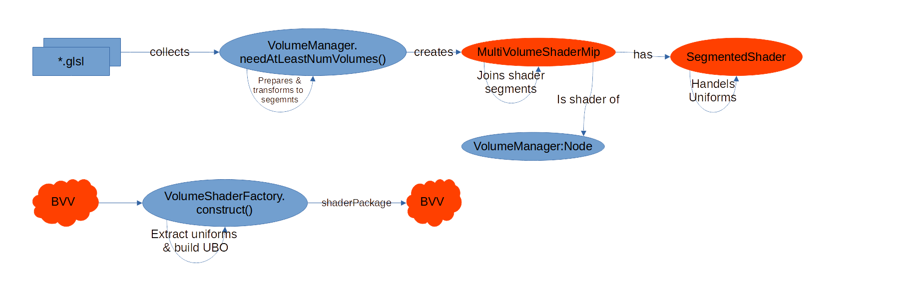

# Volumen Shader and Uniforms

Scenery uses the [BigVolumeViewer](https://github.com/tpietzsch/jogl-minimal) (BBV) for rendering volumes. Currently, there is no documentation on BBV therefore we try to explain both a bit in this chapter. However this chapter will only provide a brief overview with a focus on shader generation and uniform access.

## Shader Construction

As mentioned in [Rendering Volumetric Data](../introduction/rendering-volumetric-data.md) the Shader of the `VolumeManager` is auto generated according the type and amount of to-be-rendered volumes.



Once the `VolumeManager` decides it needs to rebuild its shader it starts with collecting all needed code snippets. The shader code is saved in multiple glsl resource files and is annotated with preprocessing commands for the joining. Also the (hardcoded) per volume uniform names are collected. (See also next chapter) A code snippet with its associated uniforms is called a `Segment`. The segements along with information about the used volumes and other things are passed the `MultiVolumeShaderMip` constructor which is part of BVV.

This constructor joins the segments to a first complete version of the shader code. This joining executes the earlier mentioned preprocessor commands, and the repetitions required to render multiple volumes. The result is saved internally as a `SegmentedShader`. This shader is still not compiled.

Once BVV plans to render the `VolumeManager` node for the first time it has to compile the shader first. But before that happens the `VolumeShaderFactory` transforms the code one last time. Among other things the uniforms which currently are strewn all over the code are extracted and placed in a UBO for Vulkan compatibility. Then finally a shaderPackage with the final code is given to BVV to compile and use.

> **_NOTE:_**   A breakpoint placed at `VolumeShaderFactory.construct(..)` before the `return` is also the optimal place to extract shader code for manual debugging.

## Uniform Access

### For all Volumes Uniform

To set general uniforms in the volume shader, they simply need to be added to the `shaderProperties` of `volumeManager`. Eg: 

```kotlin
volumeManager.shaderProperties["lineColor"] = Vector3f(0.5f)
```

and somewhere in a shader snipped a corresponding:

```glsl
uniform vec3 lineColor;
```

### Per VolumeUniform

To set a uniform per volume it needs to be declared as a per volume uniform first. If we want to have a `Vector3f slicingPlane` uniform for each volume which will be used in the sampling part of the shader we need to add it to the corresponding segments key lists in the `VolumeManager`. (At the time of writing (11.03.2021) this would be line 260 and 264 because there are two kind of sampling segments.)

Then to set them we use the `.setCustomUniformForVolume(..)` of the current shader. In our example we could add our code to the loop over `renderStacksStates` like this:

```kotlin
val durationBinding = measureTimeMillis {
    renderStacksStates
        // sort by classname, so we get MultiResolutionStack3Ds first,
        // then simple stacks
        .sortedBy { it.javaClass.simpleName }
        .forEachIndexed { i, state ->
            // ...
            currentProg.setCustomUniformForVolume(i, "slicingPlane", Vector3f(1f))
            // ...
        }
}
```

If the target uniform is an array or matrix `.setCustomFloatArrayUniformForVolume(..)` has to be used.

## See also

- [Rendering Volumetric Data](../introduction/rendering-volumetric-data.md)