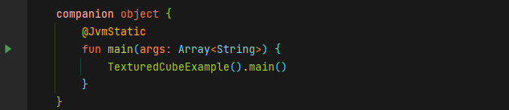

# Getting Started

## Prerequisites

For developing with scenery, or scenery itself, it's quite useful to have an IDE that supports you in your coding tasks. We recommend using IntelliJ as IDE, which is available as [free Community Edition from Jetbrains](https://www.jetbrains.com/idea/). In case you are an Eclipse user, there is a Kotlin plugin available in the Eclipse market place that can be used for development with scenery.

scenery and IntelliJ require an installed Java Development Kit \(JDK\), with versions 8, 11, and 12 being supported. scenery is fully compatible with OpenJDK, which you can download at [https://adoptopenjdk.net/](https://adoptopenjdk.net/).

## Getting the code

The git repository for scenery can be found at [https://github.com/scenerygraphics/scenery](https://github.com/scenerygraphics/scenery), you can clone the repository to your drive by running

```bash
git clone https://github.com/scenerygraphics/scenery.git
```

Should you already have a Github account and an SSH key set up with that account, you can also use

```text
git clone git@github.com:scenerygraphics/scenery.git
```

That'll clone the scenery repository to a folder named `scenery` on your hard drive.

## Repository structure

The scenery repository consists of the following major directories:

* `src/main/kotlin/graphics/scenery` contains the main scenery source code.
* `src/test/tests/graphics/scenery/tests/examples` contains example code and small applications for getting started and for demonstrating features of scenery.
* `src/test/tests/graphics/scenery/tests/unit` contains unit tests that are automatically executed when scenery is built to ensure everything is still working. scenery uses the [JUnit ](http://www.junit.org)testing framework for that.
* `src/main/resources/graphics/scenery` contains images, shader files and other files that are not Kotlin or Java source code.

Furthermore, there is an `artwork` directory, containing some scenery logos.

As a build system, scenery uses [Gradle](https://www.gradle.org), which stores all project information, such as dependencies, in the file `build.gradle.kts`.

## Running your first example

### Using Gradle on the command line

To build scenery on the command line, change to the scenery directory and run



```bash
./gradlew build
```



```
gradlew.bat build
```



This will download the Gradle version required automatically, followed by all dependencies required. Then, it will build the scenery JAR files in the `build/libs` directory. The first build will take a while because all dependencies are downloaded from teh interwebs. When the build is successful, there should be multiple files there, named `scenery-[VERSION].jar`, `scenery-[VERSION]-tests.jar`, and`scenery-[VERSION]-sources.jar`

From the scenery repository directory, you can then run



```text
./gradlew TexturedCubeExample
```



```
gradlew.bat TexturedCubeExample
```



... and the TexturedCubeExample should \(semi-\)magically show up.

### Using IntelliJ

First, import the project in IntelliJ:

* Click File &gt; Open and navigate to the scenery directory,
* Open the file `build.gradle.kts` there. When IntelliJ asks to open as project or as file, select _Open as Project_,

IntelliJ will now resolve and download all dependencies of scenery, which might take a while when you are doing this for the first time.

When IntelliJ is done importing, navigate to the examples directory with the directory browser on the left. The directory is `src/test/tests/graphics/scenery/tests/examples`a. You can alternatively switch the directory tree to _Packages_ mode and navigate to `graphics.scenery.tests.examples.basic`.

Find an example you want to run, e.g. `TexturedCubeExample`, open the file, and click on the small green _Play_ button that appears next to the main routine in that file:



The example should now compile and magically show up on screen.

## Where to go from here

The examples of scenery are a good starting point for exploring features or developing your own applications. Tinker around and modify them to your needs.

