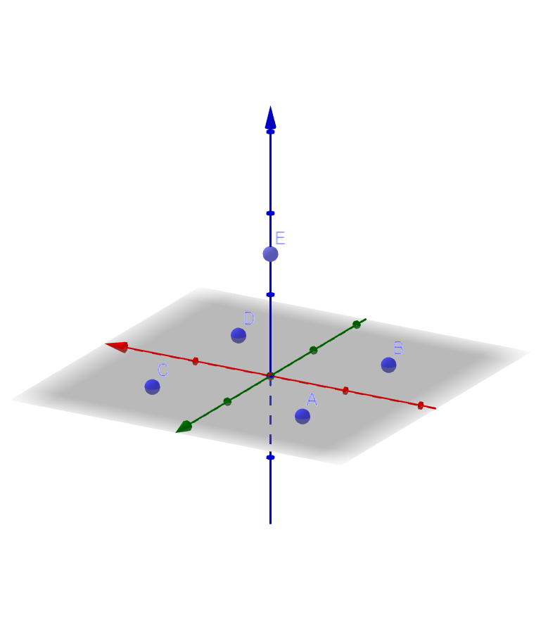
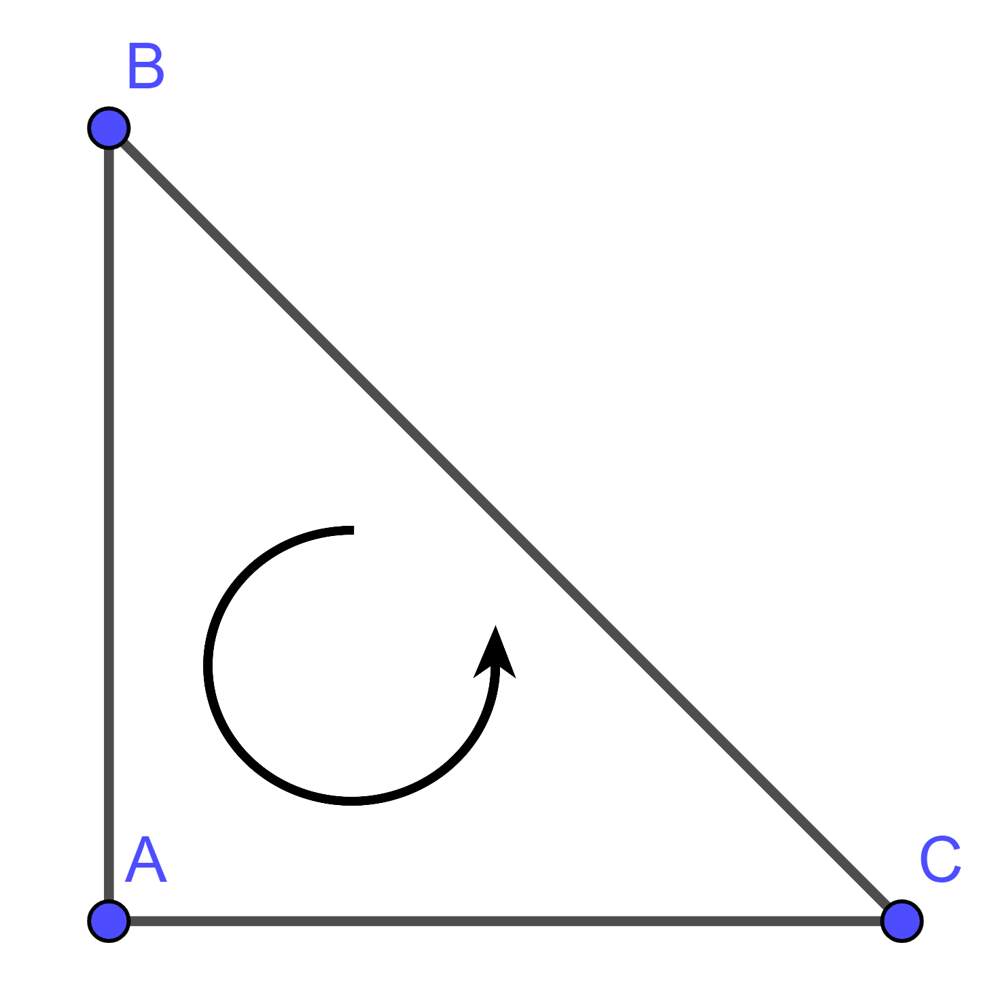
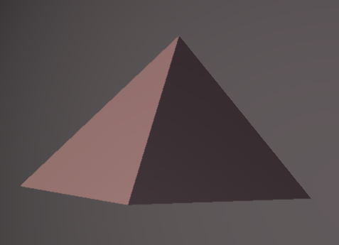

# Rendering Meshes

Meshes are, as you probably know, a collection of polygons. If you have never heard of the concept, do not worry, we will explain it on the fly. In case you still want to learn more, here is a very visual article for you: [https://conceptartempire.com/polygon-mesh/](https://conceptartempire.com/polygon-mesh/) – also virtually any introductory book on computer graphics contains this topic.

Lets jump right into it with an example! Say you would like to render the Pyramid of Cheops. Fortunately, we don't need thousands of slaves \(or aliens\) to do that. More useful in our case is a class which inherits from the Mesh class, for example like this:

```kotlin
class Pyramid: Mesh("Pyramid of Cheops") {}
```

Before we can fill the Pyramid with useful information, we need to take a look at the Mesh class itself. `Mesh` inherits both from `HasGeometry` and `Node`. Essentially this means that Mesh is both a Geometry and a Node in the scene graph. About the latter we do not need to worry until the scene setup. HasGeometry, however, is essential so lets have a closer look. Of all its attributes, `vertices` is the most important for now, because it stores the, you guessed it, vertices of our Polygon Mesh in a float buffer. For our Pyramid the vertices look like this:



Lets store these coordinates first as vectors:

```kotlin
class Pyramid: Mesh("Pyramid of Giza") {
    private val a = Vector3f(-1f, 0f, 1f)
    private val b = Vector3f(-1f, 0f, -1f)
    private val c = Vector3f(1f, 0f, 1f)
    private val d = Vector3f(1f, 0f, -1f)
    private val e = Vector3f(0f, 1.5f, 0f)
    }
```

Now we need to make a Polygon Mesh out of these. Scenery works by default with triangle meshes. So, our pyramid needs to be stored in a construct similar to:


These triangles are stored vertex by vertex in counterclockwise direction, at least if you want to render your geometry with a normal triangle geometry. Lets have a look at our first triangle: A, B, C.



It deos not matter, in which order you store the vertices as long as the order is counterclockwise, from outside the object. Consequentially, `[A; C; B]`, `[B; A; C]`, and `[C; B; A]` are the options you have in this case. Lets do this for all our triangles:

```kotlin
class Pyramid: Mesh("Pyramid of Giza") {
    private val a = Vector3f(-1f, 0f, 1f)
    private val b = Vector3f(-1f, 0f, -1f)
    private val c = Vector3f(1f, 0f, 1f)
    private val d = Vector3f(1f, 0f, -1f)
    private val e = Vector3f(0f, 1.5f, 0f)
    //indentation for didactic purposes
    val triangleList = listOf(  a, c, b, 
                                b, c, d, 
                                e, a, b, 
                                a, e, c,
                                e, d, c, 
                                d, e, b)
}
```

Now we are almost there. In the next step we will allocate and fill our vertices buffer with our vertices and then calculate a normal vector for each triangle. Fortunately, this is done by the function `recalculateNormals()`, note that the vertices must be stored in the right \(counterclockwise\) order for it to work. 

```kotlin
class Pyramid: Mesh("Pyramid of Giza") {
    private val a = Vector3f(-1f, 0f, 1f)
    private val b = Vector3f(-1f, 0f, -1f)
    private val c = Vector3f(1f, 0f, 1f)
    private val d = Vector3f(1f, 0f, -1f)
    private val e = Vector3f(0f, 1.5f, 0f)
    //indentation for didactic purposes
    val triangleList = listOf(  a, c, b, 
                                b, c, d, 
                                e, a, b, 
                                a, e, c,
                                e, d, c, 
                                d, e, b)
    init {
            vertices = BufferUtils.allocateFloat(triangleList.size * 3)
            triangleList.forEach {
                vertices.put(it.toFloatArray())
            }
            //flip the buffer so the algorithm below works properly
            vertices.flip()
            //fill with texture coordinates if you like to
            texcoords = BufferUtils.allocateFloat(triangleList.size * 2)
            recalculateNormals()
        }
    }
```

Congratulations! You just wrote your first Mesh. If you wish to render the Pyramid in a different manner, consider the enum GeometryType which give you a lot of options, e.g. rendering only the vertices. Otherwise, there it is, the mighty Pyramid of Cheops:



